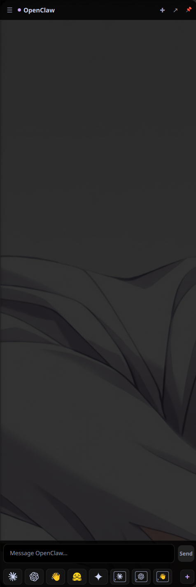

# OpenClaw flyout

<p align="center"></p>

Arch linux pinnable **Quickshell** side panel that chats with your [OpenClaw](https://openclaw.ai)
agent, backed by a tiny local **OpenAI-compatible bridge** on `127.0.0.1:8787`.

Toggle it with **Super+O**. It docks to the left edge, reserves screen space when
pinned (windows tile beside it), streams replies token-by-token, keeps a
recent-chats drawer, and can hand the same conversation off to a terminal and back.

Shell-agnostic: it runs as its own Quickshell instance (`qs -c openclaw-sidebar`),
so it survives updates to whatever bar/desktop shell you use.

---

## What's in the box

| Piece | What it does |
|-------|--------------|
| **`bin/openclaw-ai-bridge.js`** | Node HTTP service. `POST /v1/chat/completions` (streaming, OpenAI-shaped), `GET /sessions`, `GET /history`. Talks to OpenClaw via `openclaw acp` (streaming) with a one-shot `openclaw agent` fallback. Reads chat history from OpenClaw's SQLite store. Auto-starts the gateway if it's down. |
| **`systemd/openclaw-ai-bridge.service`** | `systemctl --user` unit that keeps the bridge running. |
| **`quickshell/openclaw-sidebar/`** | The panel itself (`shell.qml`) plus launcher icons. |
| **`bin/openclaw-cli-chat.sh`** | The **↗** button's hand-off: opens the *same* session in `openclaw tui`, and reopens the flyout however the terminal exits. |
| **`bin/openclaw-dashboard.sh`** | Opens the OpenClaw Control UI with a valid auth token. |

## Requirements

- **[OpenClaw](https://openclaw.ai)** installed and configured (the flyout answers via *your* agent).
- **Node.js** — runs the bridge.
- **Quickshell** (`qs`) — draws the panel. Needs a **Wayland** session (Hyprland or KDE-Wayland; it won't map on X11).
- **sqlite3** — the bridge reads chat history from OpenClaw's session store.
- A terminal for the ↗ hand-off (defaults to `alacritty`; edit `shell.qml` to change).

## Install

```sh
git clone https://github.com/janszafranski/openclaw-flyout.git
cd openclaw-flyout
./install.sh          # or: make install
```

`install.sh` deploys the bridge + panel + helper scripts into `~/.local` and
`~/.config`, installs and enables the `systemctl --user` bridge service, and — on
Hyprland with a `hyprland.lua` config — appends a guarded block that adds the
**Super+O** toggle, autostart, and a blur-off rule. On KDE/other it drops an XDG
autostart entry and prints the shortcut to bind manually.

Remove everything with `./uninstall.sh` (or `make uninstall`). Your
`shortcuts.json` is left in place.

## Configure

The bridge is configured entirely through environment variables (set them in the
systemd unit's `Environment=` lines). Common ones:

| Variable | Default | Meaning |
|----------|---------|---------|
| `OPENCLAW_BRIDGE_PORT` | `8787` | HTTP port the panel talks to. |
| `OPENCLAW_BRIDGE_SESSION` | `agent:main:ai-flyout` | Default session the flyout drives. |
| `OPENCLAW_BRIDGE_TIMEOUT` | `600` | Per-turn timeout (seconds). |
| `OPENCLAW_BRIDGE_STREAM` | `1` | `0` disables ACP streaming (one-shot only). |
| `OPENCLAW_BRIDGE_ACP_APPROVE` | `1` | `0` denies tool-permission prompts instead of auto-approving. |
| `OPENCLAW_BRIDGE_AUTOSTART_GATEWAY` | `1` | `0` won't try to start the gateway when it's down. |
| `OPENCLAW_BRIDGE_SESSION_DB` | `~/.openclaw/agents/main/agent/openclaw-agent.sqlite` | Session store to read history from. |

The **launcher bar** at the bottom of the panel is user-editable — click **+** to
add/remove shortcuts, or hand-edit `~/.config/quickshell/openclaw-sidebar/shortcuts.json`.
A starter set ships in `shortcuts.json.example`.

See **[DOCUMENTATION.md](DOCUMENTATION.md)** for the architecture, the bridge API,
IPC commands, and the hard-won design notes behind the trickier bits.

## Security

The bridge binds **loopback only** (`127.0.0.1`). Anything local that can POST to
it can run agent turns as you — that's the intended trust model for a single-user
desktop, but don't expose the port beyond localhost.

## License

MIT — see [LICENSE](LICENSE).
